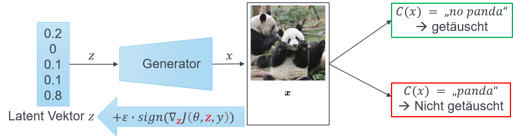

# Adversarial Latent Vector Adjustment (ALVA) <!-- omit from toc -->

## Table of Content <!-- omit from toc -->

- [General](#general)
- [ALVA Concept](#alva-concept)
  - [Related Work](#related-work)
  - [Concept Idea](#concept-idea)
- [How to use ALVA](#how-to-use-alva)
  - [Models](#models)
    - [Unconditional Generative Model](#unconditional-generative-model)
    - [Conditional Generative Model](#conditional-generative-model)
  - [Generate Samples](#generate-samples)
- [Alva Example](#alva-example)
- [Convergence Training](#convergence-training)

___

## General

Adversarial Latent Vector Adjustment (ALVA) is a novel data augmentation method proposed by the following paper: [insert link]. \
It addresses two challenges in the field of data augmentation:

- How can we generate representative data without any prior knowledge about the underlying data distribution?
- How can we ensure that the newly generated data will provide new, unseen edge cases and are therefore valuable for further training?

In this paper, the authors propose a method that leverages Adversarial Attacks (FGSM) and Generative Models (GAN) to address these challenges. For a comprehensive understanding of the ALVA, please refer to the original paper above.

___

## ALVA Concept

The concept of ALVA is based on the mathematical concept of Adversarial Attacks and requires two differentiable models (Generator and Classificator).

### Related Work

In the paper by [Goodfellow et. al](https://arxiv.org/abs/1412.6572), they discuss adversarial examples and propose a method called Fast Gradient Sign Method (FGSM) to generate such examples that "fool" a MLP. The fundamental idea behind this method is to modify a data point $x$ by adding a small perturbation obtained by computing the weighted sign of the derivative of the classification function. This can be mathematically expressed as:
$x' = x + \epsilon \cdot sign (\nabla_x J(f_\theta(x,y)))$ \
Where $x'$ is the adversarial example, that is misclassified by $C$ with $C(x) = y \And C(x') \neq y_i$. The process is illustrated below. \
 \
The original data point, depicted as orange orange, is perturbated based on the gradient (indicated by the arrow) and falls within the red shaded region. The orange dot is classified as a rectangle despite being an orange data point. The red area represents the disparity between the true and learned classification boundary. \
To minimize the difference between $x$ and $x'$ the perturbation is weighted with $\epsilon$. Therefore the data sample $x'$ looks similar to $x$. Although the FGSM is utilized as a regularization method, adding the perturbed data into the training dataset can leads to a decrease in classification accuracy. Previous research (insert link) show that the misclassification is a result of the pixel fluctuation/noise added to $x$.

### Concept Idea

The idea of ALVA is to use the guidance of FGSM but to To address this issue while still generating valid data, the approach of adversarial attack is extended by employing a generative model (GAN).
We no longer perturbate the data sample $x$ itself, but the latent vector $z$. To get a misclassification of $x'=G(z')$, where $C(x') \neq y$. \
This leads to following adaption fo the formula: \
$z' = z + \epsilon \cdot sign(\nabla_z J(f_\theta(z, y)))$ \
An successful attack is described with following illustrations. \
 \
Starting from an arbitrary latent vector $z$, we create a a data sample $(x_i, y_i)$ (It is possible to create $x$ and $y$ with a conditional GAN). Afterwards the latent vector will be attacked with $z'$ and a new data entry will be created with $(x_i',y_i)$.

___

## How to use ALVA

First of all, make sure you implement the generative model as defined below. Then use the alva code listed afterwards. For experimental purpose look into [convergence training](#convergence-training) chapter. This resulted in good results, but are not strong elaboratable on new datasets.

### Models

To use ALVA you need first of all a differentiable classificator $C$ and a differentiable generative model $G$. It is assumed that the output of $G(z)$ can be directly passed to the classificator $C$ with $C(G(z))$. While the implementation of $C$ is arbitrary, the generative model $G$ needs to inherit from base  [generative_model_base.py](src/generative_model_base.py) according to if it is [unconditional](#unconditional-generative-model) or [conditional](#conditional-generative-model).

#### Unconditional Generative Model

This generative model needs to implement `GenerativeModel` from [generative_model_base.py](src/generative_model_base.py). To inherit `GenerativeModel` you need to implement static function `get_noise()`. This function is used to get a fitting latent vector $\vec{z}$.

```python
n = 100              # Number of latent vectors.
z = G.get_noise(n)   # Returns 100 latent vectors of specific shape defined in G.
x = G(z)             # 100 data points.
```

This method has been implemented in the [example cgan](examples/models/conditional_gan.py).\
To check if the model is implemented correctly, the method `is_generative_model` in [generative_model_base.py](src/generative_model_base.py) should return `True`.

#### Conditional Generative Model

In order to use ALVA for unconditional and conditional generative models, the conditional model needs to implement `get_noise()` from [generative_model_base.py](src/generative_model_base.py) as well as inheriting `ConditionalGenerativeModel` from [generative_model_base.py](src/generative_model_base.py). For implementing `get_noise()` please see the [chapter above](#unconditional-generative-model). To inherit `ConditionalGenerativeModel` the static function `set_label()` has to be implemented. It sets the label for all generation until it is changed via `set_label()` or passed in the `forward` method of the generative model.

```python
label_class = 8 # label class refers to the number in MNIST as in example code. 
label = torch.Long([label_class])
G.set_label(label) # Now G will only generate data of the class 8 in MNIST.

# As above
n = 100
z = G.get_noise(n)
x = G(z) # Generate 100 mnist samples of class 8.
```

### Generate Samples

See [examples](#alva-example) below or see [examples source code](examples/pipeline_example.ipynb).

___

## Alva Example

___

## Convergence Training

We didn't mentioned it in the paper, but we also investigated the concept of something we call convergence training. \
We propose convergence training as repeating steps of executing the pipeline of ALVA, add the generated samples to the training dataset of the classificator and repeat the step, until the classificator can't be fooled.
